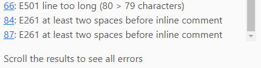
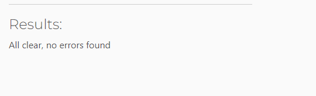
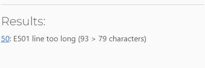
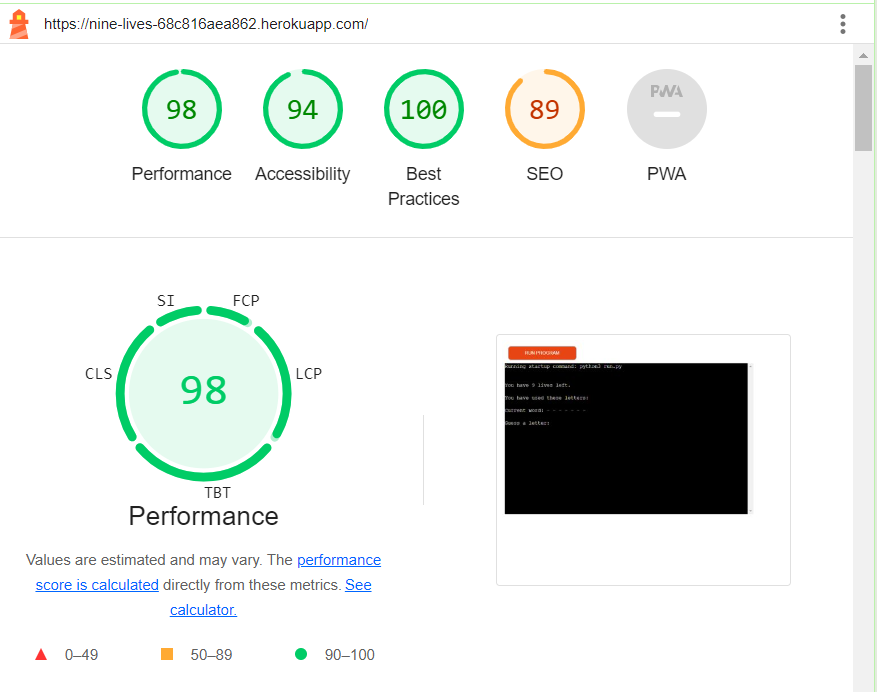
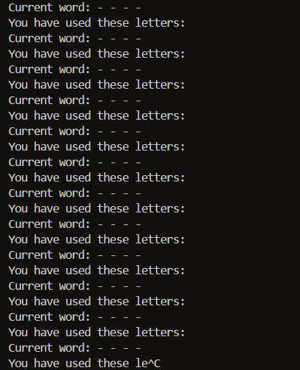
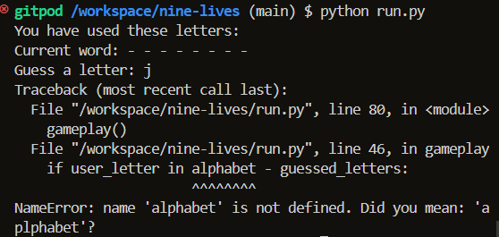
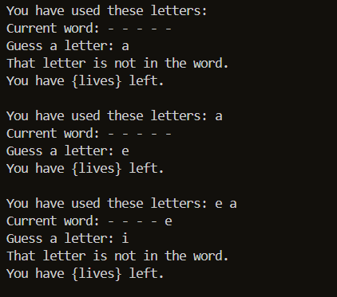
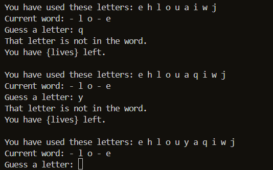
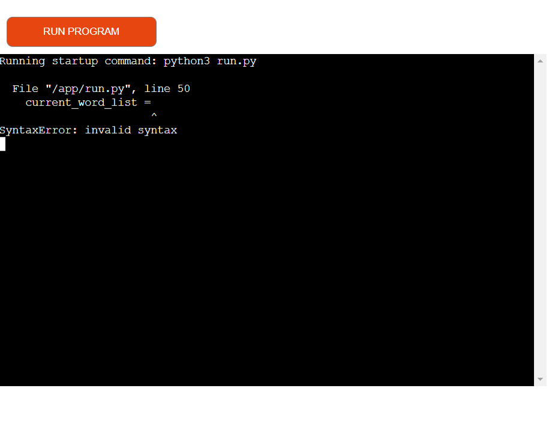

# PROJECT_NAME - Testing

Visit the deployed site: [Nine Lives](https://nine-lives-68c816aea862.herokuapp.com/).

---

## Validator Testing

### PEP8 Python Validator
[PEP8 Python Validator](https://pep8ci.herokuapp.com/) was used to test this project.

The following screenshots shows some of the errors that showed when put through the CI Python Linter.

  | Before | After |
  | --- | --- |
  |   |   |
  | --- |
  | The following is a remaining error, that can not be adjusted for now. This is further referenced in "Known Bugs" below. |
  | 

---

## LightHouse report

I used Lighthouse in DevTools to confirm that the website is in the green for performance, accessibility, best practices & SEO for Desktop.

---

## Gameplay

| Feature | Action | Expected Result | Tested | Comments |
| --- | --- | --- | --- | --- |
| Welcome prompt | Enter any key | Moves onto next command for user input | Pass | Adjust text & add design in later editions |
| Enter any key | Creates next sequence of prompts | - Displays how many lives left the user has   - A list of letters already guesssed   - What letters have been guessed correctly   - User input for the letter the user wants to guess | Pass | Adjust text & add design in later editions |
| Guess a letter | Enter any letter | A letter is accepted, regardless of casing, as all letters are converted to lowercase upon input | Pass | n/a |
| Guess a letter | Enter number | Let's user know it is an invalid data type & to try again | Pass | --- |
| Guess a letter | Enter any other keyboard character that's not a requested input type | Let's user know it is an invalid data type & to try again | Pass | --- |
| Lives remaining | User guesses incorrect letter | - A life is deducted   - Letters used has been updated so the user does not make the same mistake again   - The word to be guessed remains blank | Pass | Edit messages to the user |
| Lives remaining | User guesses a correct letter | - All lives before guess remain intact   - Letters used has been updated so the user does not use the same letter again   - The word to be guessed is updated with the correctly guessed letter | Pass | Edit messages to the user |
| Letters tried | User inputs letter guess - the letter is correct | - Letters used has been updated so the user does not use the same letter again   - The word to be guessed is updated with the correctly guessed letter | Pass | --- |
| Letters tried | User inputs letter guess - the letter is incorrect | - Letters used has been updated so the user does not make the same mistake again   - The word to be guessed remains blank | Pass | --- |
| Current Word | Letter guessed is correct | Guessed letter is filled into current word to be guessed | Pass| Edit wording of this section shown to user |
| Current Word | Letter guessed is incorrect | - Guessed letter section remains blank   - A life is deducted | Pass | Edit wording of this section shown to user |
| Guessed Letter | Accepts data input | - Valid data accepted & other data is updated accordingly   - Invalid data not accepted & message relayed to user | Pass | --- |

---

## Bugs

  ### Solved Bugs

  | # | Bug | How I solved the issue | Screenshots |
  | --- | --- | --- | --- |
  | 1 | Testing print statement would not print values. | Reviewd the code & realised I left out the argument when calling the function. | n/a |
  | 2 | Created infinte loop while creating gameplay(). Conditions not indented properly. | I indented the conditions, and the code ran as expected. |  |
  | 3 | Spelling error when outlining if statement within while loop of gameplay(). |  The original variable spelling was incorrect, as opposed to the spelling of 'alphabet' in the if statement. |  |
  | 4 | f-string not working as expected. | Forgot to insert "f" before string. |  |
  | 5 | if/else statement within gameplay() not working correctly. The game continues to play even after 9 guesses have been attempted. | Was corrected when bug #4 was also fixed. |  |
  | 6 | I had adjusted the spacing in run.py on line 50 for the variable current_word_list to comply with the linter. However, the program would not run correctly otherwise & I did not have time to come up with an alternative. Instead, I returned it to the way it was before. | 

  - Once all of the solutions were carried out, I reviewed each issue to ensure all corrections were applied & no further issues were occurring.

### Known Bugs

  | # | Bug | Screenshots |
  | --- | --- | --- |
  | 6 | I had adjusted the spacing in run.py on line 50 for the variable current_word_list to comply with the linter. However, the program would not run correctly otherwise & I did not have time to come up with an alternative. Instead, I returned it to the way it was before. | 