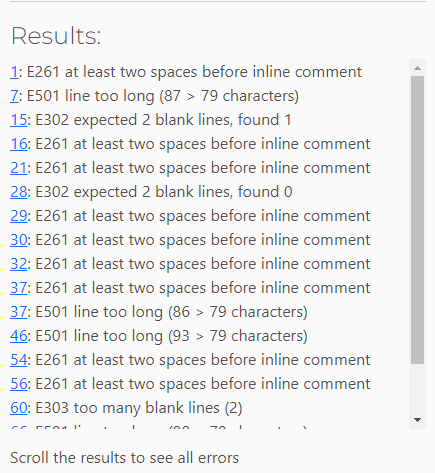

# PROJECT_NAME - Testing

Visit the deployed site: [Nine Lives](https://nine-lives-68c816aea862.herokuapp.com/).

---

## Compatability

INSERT RELEVENT TESTING FOR WEBSITES MANUALLY TESTED. OTHERS YOU MAY WANT TO INCLUDE ARE: Mozilla Firefox, Safari, Opera.

The website was tested on three different browsers: Brave, Chrome, & Microsoft Edge. It was compatable across all three.

| Browser Compatability | Brave | Chrome | Microsoft Edge |
| --- | --- | --- | --- |
| Rendering | INSERT_RESULT | INSERT_RESULT | INSERT_RESULT |
| Input Functionality| INSERT_RESULT | INSERT_RESULT | INSERT_RESULT |
| Output Functionality | INSERT_RESULT | INSERT_RESULT | INSERT_RESULT |

  ### Brave
  

  ### Chrome
  

  ### Microsoft Edge
  

---

## Validator Testing

### PEP8 Python Validator
[PEP8 Python Validator](https://pep8ci.herokuapp.com/) was used to test this project.

The following screenshots shows some of the errors that showed when put through the CI Python Linter. All were corrected before the finally returning clear of any issues.

  | Before | After |
  | --- | --- |
  |   |   |

---

## LightHouse report

I used Lighthouse in DevTools to confirm that the website is in the green for performance, accessibility, best practices & SEO for Desktop.

---

## Game Features

| Feature | Action | Expected Result | Tested | Passed | Comments |
| --- | --- | --- | --- | --- | --- |

   ### User Stories
   IF APPLICABLE
  | # | User Story | Implementation | Screenshots |
  | --- | --- | --- | --- |
  | 1 | --- |  --- | --- |

---

## Bugs

  ### Solved Bugs

  | # | Bug | How I solved the issue | Screenshots |
  | --- | --- | --- | --- |
  | 1 | Testing print statement would not print values. | Reviewd the code & realised I left out the argument when calling the function. | n/a |
  | 2 | Created infinte loop while creating gameplay(). Conditions not indented properly. | I indented the conditions, and the code ran as expected. |  |
  | 3 | Spelling error when outlining if statement within while loop of gameplay(). |  The original variable spelling was incorrect, as opposed to the spelling of 'alphabet' in the if statement. |  |
  | 4 | f-string not working as expected. | Forgot to insert "f" before string. |  |
  | 5 | if/else statement within gameplay() not working correctly. The game continues to play even after 9 guesses have been attempted. | Was corrected when bug #4 was also fixed. |  |
  | 6 | I had adjusted the spacing in run.py on line 50 for the variable current_word_list to comply with the linter. However, the program would not run correctly otherwise & I did not have time to come up with an alternative. Instead, I returned it to the way it was before. | 

  - Once all of the solutions were carried out, I reviewed each issue to ensure all corrections were applied & no further issues were occurring.

### Known Bugs

  | # | Bug | Screenshots |
  | --- | --- | --- |
  | 6 | I had adjusted the spacing in run.py on line 50 for the variable current_word_list to comply with the linter. However, the program would not run correctly otherwise & I did not have time to come up with an alternative. Instead, I returned it to the way it was before. | 